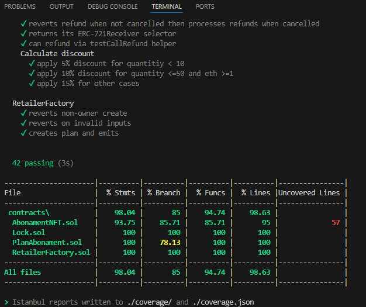
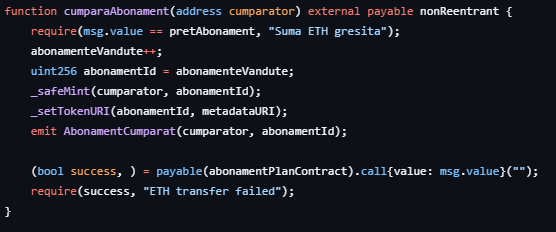
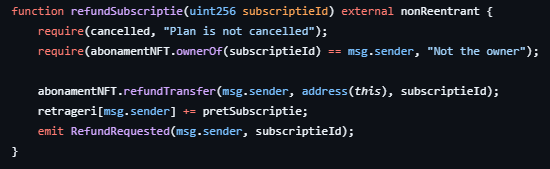

# Proiect: Testarea unei Rețele Blockchain
---

## 1. Obiective și Strategie

- Realizarea unei analize state-of-the-art pentru NFT-uri și abonamente.
- Setup și implementare smart contracts cu Hardhat.
- Testare completă: unitară, de integrare, de performanță, de securitate.
- Evaluare a scalabilității și costurilor.
- Platformă funcțională pentru gestionarea planurilor de abonamente NFT.

---

## 2. Configurație Hardware

- **Procesor:** Intel(R) Core(TM) Ultra 7 155H @ 1.40GHz  
- **Memorie RAM:** 32 GB  
- **Sistem:** 64-bit OS, arhitectură x64  
- **Mașină virtuală:** *NU a fost utilizată*

---

## 3. Configurație Software

- **Node.js** `v18+`
- **npm / yarn**
- **Framework:** Hardhat `^2.23.0`
- **Biblioteci cheie:**

```json
"dependencies": {
  "@openzeppelin/contracts": "^5.3.0",
  "ethers": "^6.13.5",
  "solidity-coverage": "^0.8.15",
  "@types/react-router-dom": "^5.3.3",
  "fast-check": "^4.1.1",
  "react-router-dom": "^7.2.0"
}
```

---

## 4. Arhitectura Aplicației

| Componentă         | Descriere |
|--------------------|----------|
| **Smart Contracts** | Cod Solidity pentru gestionarea abonamentelor NFT |
| **Frontend**        | React + Ethers.js |
| **Testare**         | Hardhat, Mocha, Chai |
| **Wallet**          | MetaMask |
| **Rețele testate**  | Ethereum Sepolia, Polygon Mumbai |

---

## 5. Testare

### ✔️ Testare Automatizată

- **Framework:** Hardhat
- **Testele includ:**
  - Emitere NFT corectă
  - Refund doar după anulare
  - Verificare balanțe
  - Limitare bilete vândute
  - Protecție ownership și erori deliberate

### ✔️ Testare Performanță

- **Setup:** Ganache local
- **Simulare:** 100 useri → bilete simultan
- **Rezultat:**  
  - Timp mediu tranzacție: `0.5s`  
  - Rată succes: `100%`

### ✔️ Testare Securitate

- Slither, Mythril, Echidna
- Protecție reentrancy
- Validări ERC-721
- DoS evitat prin verificarea transferurilor

---

## 6. Cod și Structură Proiect

```bash
my-blockchain-project/
│
├── contracts/          # Smart Contracts (Solidity)
│   └── AbonamentNFT.sol
│
├── test/               # Teste Mocha/Chai
│   └── AbonamentNFT.test.js
│
├── scripts/            # Scripturi deploy/interacțiune
│   └── deploy.js
│
├── hardhat.config.js   # Config Hardhat
└── package.json
```

---

## 7. Rezultate Vizuale


### 📸 Capturi de ecran

- Teste automatizate:
  

- Cod:
  
  

---

## 8. Comparativ Tool-uri de Testare

| Tool                  | Scop                 | Avantaje                  |
|-----------------------|----------------------|----------------------------|
| Hardhat               | Framework principal  | Rapid, integrat, extensibil |
| Solidity-Coverage     | Acoperire cod        | Vizualizare completă       |
| Mythril, Slither      | Securitate           | Analiză statică            |
| Ganache, JMeter       | Performanță          | Simulări local + benchmark |

---

## 9. Funcționalități Platformă

- Creează plan de abonamente (`createSubscriptionPlan`)
- Cumpără NFT (`cumparaSubscriptie`)
- Refund utilizator (`refundSubscriptie`)
- Anulează plan (`cancelPlan`)
- Retrage fonduri (`withdraw`)

---

## 10. Deployment Exemplu

```solidity
const [deployer] = await ethers.getSigners();
const Factory = await ethers.getContractFactory("RetailerFactory");
const factory = await Factory.deploy(deployer.address);
await factory.createSubscriptionPlan(...);
```

---

## 11. Sugestii de Extindere

- Chainlink Keepers → reînnoire automată
- Integrare ERC-20 / stablecoin
- Interfață frontend completă (React + Wagmi)

---

## 12. Referințe

- [OpenZeppelin Docs](https://docs.openzeppelin.com/)
- [Hardhat Documentation](https://hardhat.org/)
- [ERC-721 EIP](https://eips.ethereum.org/EIPS/eip-721)
- [Smart Contract Best Practices (Consensys)](https://consensys.github.io/smart-contract-best-practices/)
- [Ethereum Smart Contract Testing Guide](https://ethereum.org/en/developers/docs/smart-contracts/testing/)

---

## 13. Utilizarea AI în Proiect

- Generare cod repetitiv
- Propuneri pentru teste unitare
- Documentare rapidă
- Codul și testele au fost verificate și ajustate manual

---
